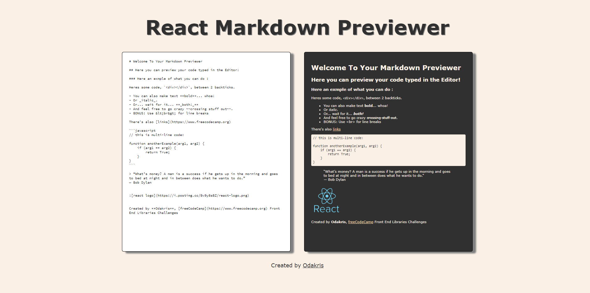

# FCC - React Markdown Previewer


Live demo of **[Markdown Previewer](https://codepen.io/odakris/full/xxyZvMj)**

## Description

This is a markdown previewer.

This project is part of the **[freeCodeCamp](https://www.freecodecamp.org/learn/front-end-development-libraries/)** Front End Development Libraries Projects certification.

<p align="center">
  
</p>

## Instructions

Clone this repository and install the NPM packages:

```
npm install
```

In the project directory, run the following script:

```
npm start
```

Open [http://localhost:3000](http://localhost:3000) to view it in the browser.
